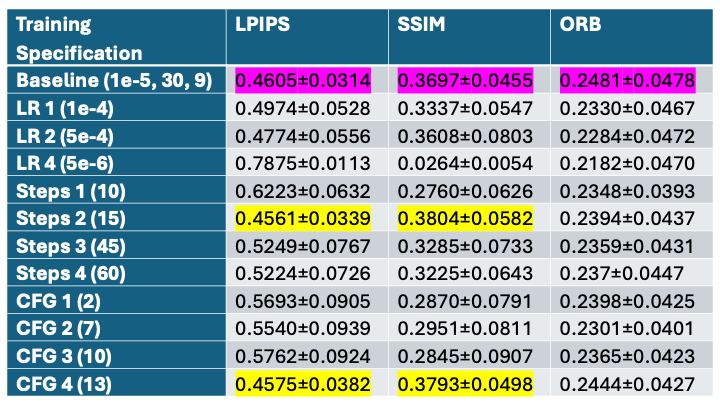
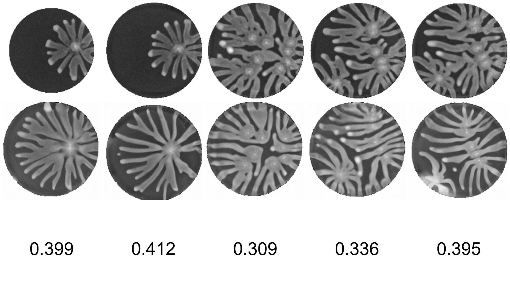
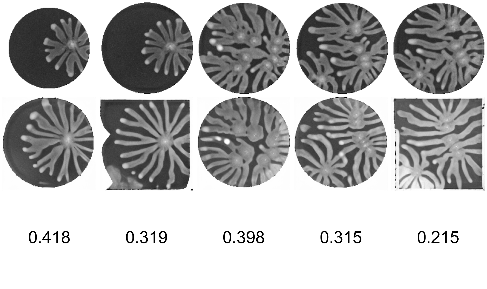
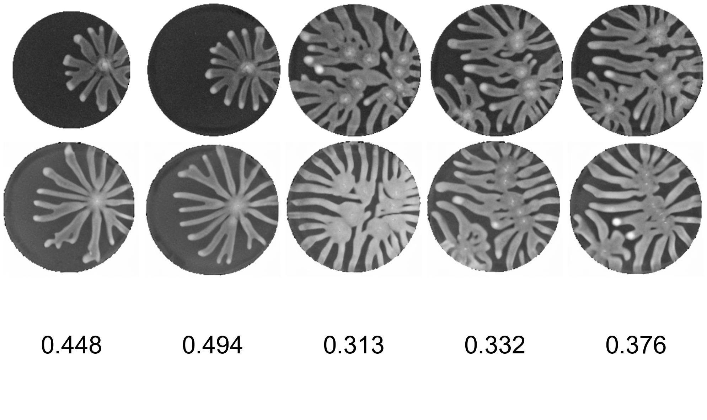

# Bacterial Pattern Prediction
The goal of this project was to download an existing code base used to predict bacterial growth patternings from simulations of their initial seeds. My contribution was modifying the training script in order to see if there was further optimization to be found in the hyperparameters.
## What It Does
My side of the project was testing the Control Diffusion Latent Model for predicting experimental bacterial growth patterns from mechanistic simulations of initial seeds. The first component to this is that there is a pretrained VAE that encodes a latent representation of an image of the simulation. This then acts as an input to the diffusion model, much in the same way as a CLIP embedding of a text prompt. The diffusion model is a combination of a Stable Diffusion model with pretrained weights and a ControlNet architecture whose weights are randomly configured. This means that during training, both transfer learning as well as normal training are occuring. The diffusion model is used to create a prediction of the true experimental patterns, and this is compared to images that were taken of experiments perfomed with the same starting seed.
## Quick Start
Expanded details are in the set up file.

Create the conda environment first. Next, extract all data from the Huggingface library and reconfigure the config file located in data. Run the data augmentation script on the experimental and simulation file, and update the config file located in /models/cldm. Download the V1-5 checkpoint, and run 
```
    python tool_add_control.py v1-5-pruned.ckpt ./control_sd15_ini.ckpt
```
The training scripts should then be run, followed by the batch infer script for each checkpoint created. This should create many new inference folders with predictions from the new models, which can then be used in the quantmetric notebook found in notebooks.
## Video Links
Videos can either be found as mp4s in the videos folder or at these links for the [demo](https://duke.zoom.us/rec/play/c9Dw93wIFj5_LjVKdi6rvnfzP5gGg3ZLi68ebys5m4LWoFnotbfaCQWkSA4idK3DsCm0YA-gEjlYSzCy.v6OuGvxOGhIK7hdu) and [technical walkthrough](https://duke.zoom.us/rec/play/d4fAGYvUWnWATSN9oH4A9aVhhc2AUFsj7GOQvmEOOjI0UqXwKzn4krE-FU9laInwmifNLAmwrKG5X-vV.VlzA9NZPDQG6eevl). The correct video for technical walkthough in the repo is the one titled technical_walkthrough, ignore technical 1 and 2.
## Evaluation
Quantitative results of different tests:



To read the qualitative analysis, the top line is the experimental image, the middle is the model's prediction, and the third is the SSIM score for the image.

Qualitative Baseline:

Qualitative CFG1:

Qualitative Step 2:

Qualitative CFG4:

